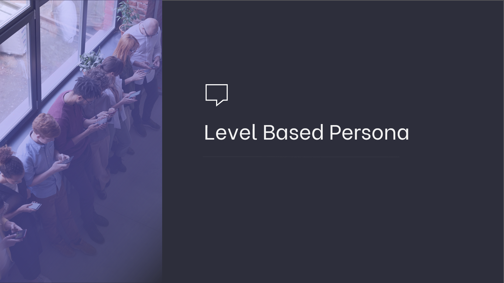

# Level Based Persona



## Business Problem & Purpose

To make new customer definitions by using the characteristics of individual customers  **(level based persona)**.

Segmenting new customer definitions.

Integrate system with the new future users.  

------

## Project Steps

- Thinking about the concept of persona.
- To be able to define new customers according to the levels.
- Simply segment new customer definitions using the qcut function.
- When a new customer arrives, classify them according to segments. 


## Dataset Information

There are two different tables showing the customers' characteristics and transaction information. 

**users.csv** shows the characteristic features of the customers, 

**purchases.csv** shows the transaction information of the customers.

Each user has a unique customer number (**uid**). 

The process of combining both tables can be done with the (**uid**) number. 

---

## Features

**users.csv**

- **uid**: Unique customer number
- **reg_date:** Customer's registration date
- **device**:  Type of product used by the customer. (Android, iOS) 
- **gender**: Customer’s gender
- **country**: Customer's country 
- **age**: Customer’s age

**purchaces.csv**

- **uid**: Unique customer number
- **date:** The date the customer made a purchase 
- **price:** Customer spend amount 

---

### Libraries

```
pandas
matplotlib
```

----

### Author

**Oğuz Han Erdoğan** -  [oguzerdo](https://github.com/oguzerdo)

---

### Reference:

```
VBO - Data Science and Machine Learning Bootcamp
www.veribilimiokulu.com
```

